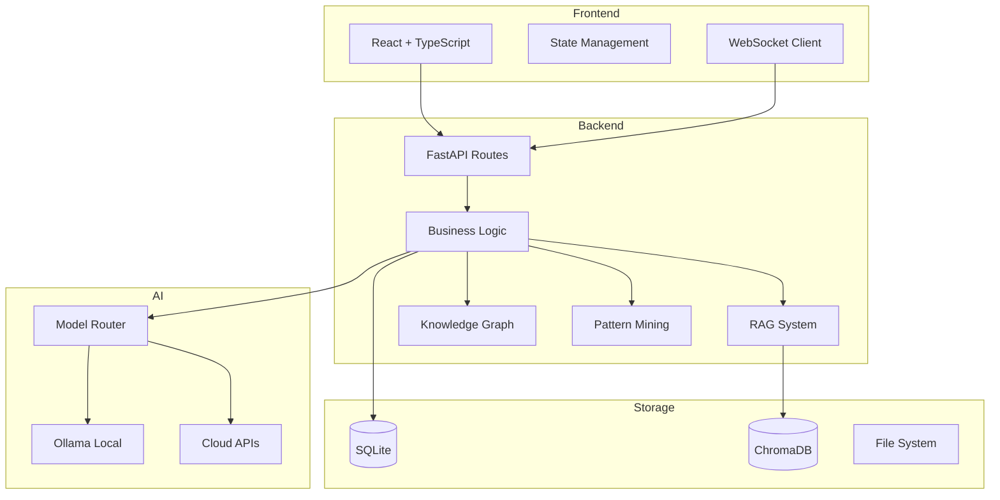

# Architect.AI Feature Highlights 🚀

## What Makes This Different

| Traditional AI Tools | Architect.AI |
|---------------------|--------------|
| Generic outputs | Context-aware generation from YOUR codebase |
| Single model | Multi-model routing (local + cloud) |
| Fixed artifact types | Extensible with custom types |
| Chat-only | Agentic with tool use + write capabilities |
| Manual configuration | AI-assisted model selection |

---

## Core Features

### 1. 🧠 5-Layer Intelligence System

```
┌─────────────────────────────────────────────────────────────┐
│                     GENERATION REQUEST                       │
└─────────────────────────────────────────────────────────────┘
                              │
                              ▼
┌─────────────────────────────────────────────────────────────┐
│  Layer 1: RAG (Retrieval-Augmented Generation)              │
│  • Hybrid search (vector + BM25)                            │
│  • Relevant code chunks from YOUR project                   │
│  • HyDE for better semantic matching                        │
└─────────────────────────────────────────────────────────────┘
                              │
                              ▼
┌─────────────────────────────────────────────────────────────┐
│  Layer 2: Knowledge Graph                                    │
│  • AST parsing of Python/TypeScript/JavaScript              │
│  • Maps classes, functions, relationships                   │
│  • Component dependency analysis                            │
└─────────────────────────────────────────────────────────────┘
                              │
                              ▼
┌─────────────────────────────────────────────────────────────┐
│  Layer 3: Pattern Mining                                     │
│  • Design pattern detection (Singleton, Factory, etc.)      │
│  • Code smell identification                                │
│  • Security vulnerability scanning                          │
└─────────────────────────────────────────────────────────────┘
                              │
                              ▼
┌─────────────────────────────────────────────────────────────┐
│  Layer 4: Meeting Notes                                      │
│  • Requirements from stakeholder meetings                   │
│  • Business context and constraints                         │
│  • User stories and acceptance criteria                     │
└─────────────────────────────────────────────────────────────┘
                              │
                              ▼
┌─────────────────────────────────────────────────────────────┐
│  Layer 5: AI Analysis                                        │
│  • Combines all context intelligently                       │
│  • Model-specific prompting strategies                      │
│  • Quality validation and auto-retry                        │
└─────────────────────────────────────────────────────────────┘
                              │
                              ▼
┌─────────────────────────────────────────────────────────────┐
│                  CONTEXT-AWARE ARTIFACT                      │
└─────────────────────────────────────────────────────────────┘
```

---

### 2. 📊 50+ Artifact Types (Categorized)

#### Mermaid Diagrams
- ERD (Entity Relationship)
- Architecture Overview
- Sequence Diagrams
- Flowcharts
- Class Diagrams
- State Machines
- Git Flow
- User Journey

#### C4 Architecture
- System Context
- Container Diagram
- Component Diagram

#### Code Generation
- Full Prototypes (React, Angular, Vue, Python, Node.js)
- API Controllers
- Database Schemas
- Unit Tests

#### Documentation
- API Documentation
- README files
- Architecture Decision Records (ADRs)

#### Project Management
- Jira User Stories
- Sprint Planning
- Feature Scoring (RICE, ICE)
- Personas & Journeys
- Backlog Management
- Effort Estimations

#### Custom Types ✨ NEW
- User-defined artifact types
- Custom categories
- Template-based generation

---

### 3. 🤖 Multi-Model Support

| Provider | Models | Best For |
|----------|--------|----------|
| **Ollama (Local)** | Llama 3, DeepSeek Coder, Mistral, CodeLlama | Privacy, speed, code generation |
| **Google Gemini** | gemini-1.5-pro, gemini-1.5-flash | Complex reasoning, long context |
| **OpenAI** | GPT-4o, GPT-4-turbo | High-quality prose, analysis |
| **Groq** | Llama 70B, Mixtral | Fast inference, chat |
| **Anthropic** | Claude 3.5 Sonnet | Code review, detailed explanations |

**Smart Model Routing:**
- Each artifact type has optimized model assignments
- Automatic fallback chain if primary model fails
- AI-assisted model selection ("Ask AI" feature)

---

### 4. 💬 Agentic Chat System

**Capabilities:**
```
┌─────────────────────────────────────────────────────────────┐
│                      AGENTIC CHAT                            │
├─────────────────────────────────────────────────────────────┤
│                                                              │
│  READ OPERATIONS (Always Available):                         │
│  ├─ search_codebase - Semantic search across files          │
│  ├─ read_file - Read specific file contents                 │
│  ├─ list_files - Directory listing                          │
│  ├─ query_knowledge_graph - Explore relationships           │
│  └─ get_project_patterns - Detected patterns & smells       │
│                                                              │
│  WRITE OPERATIONS (Requires Write Mode):                     │
│  ├─ create_artifact - Generate new artifact files           │
│  └─ update_artifact - Modify existing artifacts             │
│                                                              │
└─────────────────────────────────────────────────────────────┘
```

**Safety Features:**
- Write Mode is OFF by default
- Visual warning when Write Mode is enabled
- Clear indication of which mode is active
- Session-based persistence

---

### 5. 📁 Folder-Scoped Artifacts ✨ NEW

**How it works:**
```
data/meeting_notes/
├── ecommerce_project/
│   └── requirements.md
├── healthcare_api/
│   └── requirements.md
└── fintech_dashboard/
    └── requirements.md

When you select a folder:
• Artifacts are generated using THAT folder's context
• Generated artifacts are tagged with folder_id
• Filter artifacts by project in the UI
```

**Benefits:**
- Keep different projects organized
- Context doesn't bleed between projects
- Easy to switch between work streams

---

### 6. 🎯 AI-Assisted Model Mapping ✨ NEW

Don't know which model to use? Let AI decide!

1. Click "Ask AI" next to any artifact type
2. AI analyzes:
   - Artifact requirements
   - Available models (local + cloud)
   - Task complexity
3. Recommends primary + fallback models
4. One-click to apply suggestion

---

## Technical Architecture



---

## Performance Targets

| Metric | Target | Notes |
|--------|--------|-------|
| RAG Retrieval Relevance | 90%+ | Verified via feedback loop |
| Generation Quality Score | 85%+ | Automatic validation |
| Cache Hit Rate | 70%+ | For repeated queries |
| Response Time (simple) | < 10s | Single artifact |
| Response Time (complex) | < 30s | Code prototypes |
| Concurrent Users | 50+ | WebSocket connections |

---

## Why Architect.AI?

1. **For Individual Developers:**
   - Faster artifact generation
   - Consistent documentation
   - Learn from codebase patterns

2. **For Teams:**
   - Standardized outputs
   - Shared model configurations
   - Institutional knowledge capture

3. **For Organizations:**
   - Local-first option (data privacy)
   - Customizable artifact types
   - Integration-ready APIs

---

## Quick Start

```bash
# 1. Install
git clone <repo>
pip install -r requirements.txt
cd frontend && npm install

# 2. Run
./launch.bat   # Windows
./launch.sh    # Linux/Mac

# 3. Open
http://localhost:3000
```

---

*Architect.AI v3.5.2 - Transform requirements into reality* 🎯
