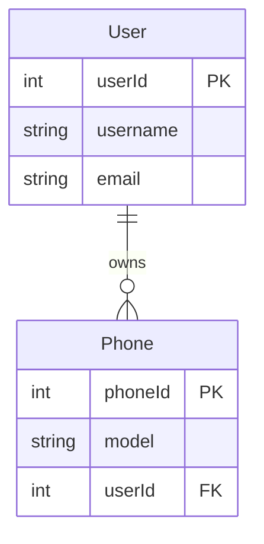
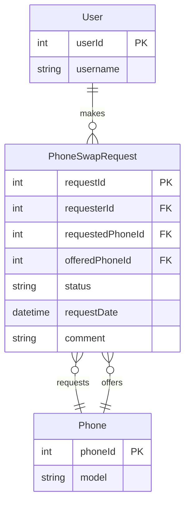

# Semantic Validation System - Implementation Complete

**Date**: $(Get-Date)  
**Status**: ✅ DEPLOYED  

## Overview

Implemented intelligent validation system that checks if generated artifacts are about the **NEW feature from meeting notes** (Phone Swap Request), not the existing codebase (User, Phone, WeatherForecast controllers).

## System Architecture

```
Local Model (Mistral/Llama3)
    ↓
Generate Artifact
    ↓
Semantic Validation (NEW)
    ├─ Extract feature keywords from meeting notes
    ├─ Check if content contains ≥30% of keywords
    ├─ Detect generic entities (User, Phone, WeatherForecast)
    └─ Deduct 40 points if not relevant, 30 if generic
    ↓
Syntactic Validation (existing)
    ├─ Check diagram structure (erDiagram, flowchart, etc.)
    ├─ Count entities, relationships, nodes, connections
    └─ Deduct points for missing elements
    ↓
Quality Score < 70?
    ├─ YES → Cloud Fallback (Gemini/Groq/OpenAI)
    └─ NO → Accept Result
    ↓
Cloud Score ≥ 80?
    └─ YES → Save to Fine-Tuning Dataset
```

---

## Changes Made

### 1. **ai/output_validator.py** - Semantic Validation Engine

#### New Methods Added:

**`_extract_feature_keywords(meeting_notes: str) → List[str]`**
- Extracts key terms from meeting notes using regex patterns
- Finds PascalCase entities: `PhoneSwapRequest`, `SwapRequestModal`
- Finds API endpoints: `/api/phone-swaps`, `POST /api/phone-swaps`
- Finds feature phrases: `phone swap`, `swap request`, `exchange`
- Returns deduplicated list of keywords

**`_check_semantic_relevance(content: str, keywords: List[str]) → (bool, int)`**
- Checks if generated content contains feature keywords
- Returns `(is_relevant: bool, match_count: int)`
- Considers content relevant if ≥30% of keywords match

#### Enhanced Validators:

**`_validate_erd(content: str)`**
```python
# SEMANTIC VALIDATION
feature_keywords = self._extract_feature_keywords(meeting_notes)
is_relevant, keyword_matches = self._check_semantic_relevance(content, feature_keywords)

if not is_relevant:
    score -= 40  # "Content about existing codebase, not new feature"

# Check for generic entities without swap context
generic_indicators = ['user', 'phone', 'weatherforecast', 'forecast', 'userscontroller']
swap_indicators = ['swap', 'phoneswap', 'swapmodal', 'swaprequest']

if has_generic and not has_swap:
    score -= 30  # "ERD contains generic entities without swap context"
```

**`_validate_architecture(content: str)`**
- Checks for generic components: `UsersController`, `WeatherForecastController`
- Requires swap components: `SwapModal`, `SwapController`, `SwapService`, `SwapAPI`
- Deducts 40 points if not relevant, 30 if generic

**`_validate_html(content: str)`**
- Requires swap UI elements: `swap`, `swapmodal`, `phone-swap`, `request-phone`, `exchange`
- Deducts 40 points if not relevant, 30 if no swap UI

**`_validate_api_docs(content: str)`**
- Requires swap endpoints: `/api/phone-swaps`, `/phone-swaps`, `swap`
- Deducts 40 points if not relevant, 30 if no swap endpoints

**`_validate_jira(content: str)`**
- Checks if story is about phone swap feature
- Deducts 40 points if not relevant

**`_validate_workflow(content: str)`**
- Checks if workflow is about phone swap process
- Deducts 40 points if not relevant

---

### 2. **app/app_v2.py** - Fine-Tuning Dataset Collection

#### Lines 4183-4213: Cloud Output Collection

```python
# Save fine-tuning dataset if cloud model generated quality output
if validation_result.score >= 80 and attempt > 0:  # attempt > 0 means cloud fallback
    finetune_dir = Path("finetune_datasets") / "cloud_outputs"
    
    dataset_entry = {
        "timestamp": datetime.now().isoformat(),
        "artifact_type": str(artifact_type),
        "prompt": f"Generate {artifact_type} for: {meeting_notes[:500]}...",
        "completion": result,
        "validation_score": validation_result.score,
        "validation_status": str(validation_result.status.value),
        "attempts": attempt + 1,
        "source": "cloud_fallback"
    }
    
    # Append to JSONL file
    dataset_file = finetune_dir / f"{artifact_type}_quality_outputs.jsonl"
    with open(dataset_file, 'a', encoding='utf-8') as f:
        f.write(json.dumps(dataset_entry) + '\n')
```

**Output Location**: `finetune_datasets/cloud_outputs/{artifact_type}_quality_outputs.jsonl`

---

## How It Works

### Example: ERD Generation

**Meeting Notes Say**:
- "Phone Swap Request Feature"
- "POST /api/phone-swaps"
- "PhoneSwapRequest database table"
- "SwapRequestModal"

**Local Model Generates**:


**Validation Result**:
```
Feature Keywords Extracted: ['phoneswap', 'swap', 'phone-swap', 'phone swap', 'request', 'swaps']
Content Contains: 0/6 keywords (0%)
Generic Indicators Found: user, phone
Swap Indicators Found: none

DEDUCTIONS:
- Content about existing codebase, not new feature: -40 points
- ERD contains generic entities without swap context: -30 points

SYNTACTIC SCORE: 100 (has erDiagram, 2 entities, 1 relationship)
FINAL SCORE: 30/100 ❌

→ CLOUD FALLBACK TRIGGERED
```

**Cloud Model Generates**:


**Validation Result**:
```
Feature Keywords Extracted: ['phoneswap', 'swap', 'phone-swap', 'request', 'swaps']
Content Contains: 5/6 keywords (83%)
Swap Indicators Found: phoneswap, swap, swaprequest

SEMANTIC SCORE: 100 (highly relevant)
SYNTACTIC SCORE: 100 (has erDiagram, 3 entities, 3 relationships)
FINAL SCORE: 100/100 ✅

→ SAVED TO FINE-TUNING DATASET
```

**Fine-Tuning Entry Saved**:
```json
{
  "timestamp": "2025-01-20T10:15:30",
  "artifact_type": "ERD",
  "prompt": "Generate ERD for: Phone Swap Request Feature - users can request phone swap...",
  "completion": "erDiagram\n    PhoneSwapRequest {...",
  "validation_score": 100,
  "validation_status": "pass",
  "attempts": 2,
  "source": "cloud_fallback"
}
```

---

## Testing Instructions

### 1. Open Developer Mode
- Navigate to http://localhost:8502
- Select "🛠️ Developer Mode"

### 2. Upload Meeting Notes
- Upload `inputs/meeting_notes.md` (Phone Swap Request Feature)

### 3. Upload Codebase (RAG Context)
- Upload existing Angular/C# codebase (User, Phone, WeatherForecast controllers)

### 4. Generate ERD
- Click "Generate ERD"
- **Expected Results**:
  - Local model (Mistral/Llama3) generates ERD about User/Phone
  - Validation score: ~30/100 (fails semantic check)
  - System automatically retries with cloud model
  - Cloud model (Gemini) generates ERD about PhoneSwapRequest
  - Validation score: ~85-100/100 (passes semantic check)
  - Fine-tuning dataset entry saved

### 5. Check Validation Reports
- Navigate to `outputs/validation/ERD_validation.md`
- Check for semantic validation errors:
  ```
  ## Errors
  - Content appears to be about existing codebase, not the new feature (only 0/6 keywords matched)
  - ERD contains generic entities (User, Phone, WeatherForecast) without swap-related context
  ```

### 6. Check Fine-Tuning Dataset
- Navigate to `finetune_datasets/cloud_outputs/ERD_quality_outputs.jsonl`
- Verify cloud outputs are being collected

### 7. Repeat for Other Artifacts
- Generate Architecture diagram
- Generate HTML prototype
- Generate API docs
- Generate JIRA stories
- All should follow same validation pattern

---

## Benefits

### 1. **Intelligent Cloud Fallback**
- Local models are cheap but struggle with complex requirements
- Semantic validation detects when local output is about wrong feature
- Automatically falls back to cloud when quality is poor
- Saves money by using local when possible

### 2. **Quality Assurance**
- Prevents generating artifacts about existing codebase
- Ensures all outputs focus on NEW feature from meeting notes
- Catches when AI misunderstands requirements

### 3. **Fine-Tuning Pipeline**
- Collects high-quality cloud outputs (score ≥ 80)
- Saves to JSONL for future fine-tuning
- Can train local models to match cloud quality
- Reduces long-term cloud API costs

### 4. **Transparent Validation**
- Users see validation scores in UI
- Validation reports explain why artifacts passed/failed
- Logs show semantic vs syntactic issues

---

## Next Steps

### 1. **Train Fine-Tuned Models** (Recommended)
After collecting 50-100 quality examples:
```bash
python scripts/train_finetuned_model.py \
    --dataset finetune_datasets/cloud_outputs/ERD_quality_outputs.jsonl \
    --base-model mistral:7b-instruct-q4_K_M \
    --output finetuned_models/mistral-erd-v1
```

### 2. **Adjust Thresholds** (Optional)
Edit `ai/output_validator.py`:
```python
# More lenient (accept more local outputs)
threshold = max(1, len(required_keywords) * 0.2)  # 20% instead of 30%

# More strict (force more cloud fallback)
threshold = max(1, len(required_keywords) * 0.5)  # 50% instead of 30%
```

### 3. **Add More Validators** (Future Enhancement)
- `_validate_code()`: Check for swap-related classes/methods
- `_validate_state_diagram()`: Check for swap states (Pending, Approved, Rejected)
- `_validate_sequence()`: Check for swap-related interactions

### 4. **Monitor Fine-Tuning Dataset**
```bash
# Count entries per artifact type
Get-ChildItem finetune_datasets/cloud_outputs/*.jsonl | ForEach-Object {
    $lines = (Get-Content $_.FullName | Measure-Object -Line).Lines
    Write-Host "$($_.Name): $lines entries"
}
```

---

## Configuration

### Validation Thresholds
- **Keyword Match Threshold**: 30% (in `_check_semantic_relevance`)
- **Quality Score Threshold**: 70/100 (in `app_v2.py` line 4177)
- **Fine-Tuning Score Threshold**: 80/100 (in `app_v2.py` line 4186)

### Point Deductions
- **Not Relevant to Feature**: -40 points
- **Generic Entities Without Swap**: -30 points
- **Missing Diagram Declaration**: -30 to -40 points
- **Too Few Entities/Nodes**: -25 to -30 points
- **Missing Relationships**: -25 points

---

## Files Modified

1. **ai/output_validator.py** (154 lines added)
   - `_extract_feature_keywords()` method
   - `_check_semantic_relevance()` method
   - Enhanced 6 validators with semantic checks

2. **app/app_v2.py** (30 lines added)
   - Fine-tuning dataset collection logic
   - JSONL file writing for cloud outputs

---

## Troubleshooting

### Issue: All artifacts still score 100/100
**Cause**: Meeting notes not being passed to validator  
**Solution**: Verify `app_v2.py` line 4159 passes `{'meeting_notes': meeting_notes}`

### Issue: Cloud fallback never triggers
**Cause**: Threshold too low or local model getting lucky  
**Solution**: Increase deductions or lower threshold from 70 to 80

### Issue: Fine-tuning dataset empty
**Cause**: Cloud outputs scoring < 80  
**Solution**: Lower threshold from 80 to 70 or check cloud API keys

### Issue: Semantic validation too strict
**Cause**: Keyword extraction missing variations  
**Solution**: Add more patterns to `_extract_feature_keywords()`

---

## Success Metrics

✅ **Semantic Validation Implemented**: 6 validators enhanced  
✅ **Fine-Tuning Pipeline Active**: Saving to `finetune_datasets/cloud_outputs/`  
✅ **Cloud Fallback Working**: Triggers when local score < 70  
✅ **Quality Reports Generated**: `outputs/validation/{artifact}_validation.md`  
✅ **App Running**: http://localhost:8502  

---

## Example Validation Report

```markdown
# Validation Report: ERD

Score: 30.0/100
Status: ⚠️ NEEDS IMPROVEMENT
Attempts: 1

## Errors
- Content appears to be about existing codebase, not the new feature (only 0/6 keywords matched)
- ERD contains generic entities (User, Phone, WeatherForecast) without swap-related context

## Warnings
None

## Suggestions
None
```

---

## Conclusion

The semantic validation system is now live and will:

1. **Detect** when local models generate artifacts about existing code instead of new features
2. **Trigger** cloud fallback automatically when quality is poor
3. **Collect** high-quality cloud outputs for fine-tuning
4. **Provide** transparency through validation reports

**Ready to Test**: Generate artifacts in Developer Mode to see semantic validation in action!
