# 🏗️ Architect.AI v3.5.0 - Technical Documentation

**Comprehensive Technical Reference for Developers, Architects, and Stakeholders**

---

## Table of Contents

1. [System Architecture](#system-architecture)
2. [End-to-End Data Flow](#end-to-end-data-flow)
3. [Intelligence Systems](#intelligence-systems)
4. [Validation & Quality Assurance](#validation--quality-assurance)
5. [Dual Fine-Tuning Architecture](#dual-fine-tuning-architecture)
6. [AI Provider Integration](#ai-provider-integration)
7. [RAG System Deep-Dive](#rag-system-deep-dive)
8. [API Reference](#api-reference)
9. [Extension Guide](#extension-guide)
10. [Performance & Optimization](#performance--optimization)
11. [Troubleshooting](#troubleshooting)

---

## System Architecture

### High-Level Overview

```
┌─────────────────────────────────────────────────────────────────┐
│                    ARCHITECT.AI v3.5.0                          │
│            Enterprise AI Development Platform                    │
└─────────────────────────────────────────────────────────────────┘
                              │
                              ▼
┌─────────────────────────────────────────────────────────────────┐
│                      INPUT LAYER                                │
├─────────────────────────────────────────────────────────────────┤
│  • Meeting Notes (Markdown/Text)                                │
│  • Feature Requirements                                         │
│  • User Stories                                                 │
└─────────────────────────────────────────────────────────────────┘
                              │
                              ▼
┌─────────────────────────────────────────────────────────────────┐
│                  PREPROCESSING LAYER                            │
├─────────────────────────────────────────────────────────────────┤
│  • Noise Reduction Pipeline (components/validation_pipeline.py) │
│    - Regex preprocessing (remove comments, debug statements)    │
│    - Stop-word removal (60+ common words)                       │
│    - Whitespace normalization                                   │
│    - Keyword extraction (min 3 chars)                           │
└─────────────────────────────────────────────────────────────────┘
                              │
                              ▼
┌─────────────────────────────────────────────────────────────────┐
│                    CONTEXT RETRIEVAL LAYER                      │
├─────────────────────────────────────────────────────────────────┤
│  • RAG System (rag/retrieve.py, rag/advanced_retrieval.py)     │
│    - ChromaDB vector search (semantic similarity)               │
│    - BM25 keyword search (exact term matching)                  │
│    - Hybrid reranking (combines both methods)                   │
│    - Model-aware chunk limits (18-100 chunks)                   │
│    - Context optimization (fits within token budget)            │
└─────────────────────────────────────────────────────────────────┘
                              │
                              ▼
┌─────────────────────────────────────────────────────────────────┐
│                  INTELLIGENCE ANALYSIS LAYER                    │
├─────────────────────────────────────────────────────────────────┤
│  1. Knowledge Graph (components/knowledge_graph.py - 752 lines) │
│     - AST parsing for Python (imports, classes, functions)      │
│     - Regex parsing for TypeScript, C#, Java                    │
│     - NetworkX graph construction                               │
│     - Metrics: coupling, clustering, complexity                 │
│                                                                  │
│  2. Pattern Mining (components/pattern_mining.py - 967 lines)   │
│     - Design pattern detection (Singleton, Factory, Observer)   │
│     - Anti-pattern detection (God Class, Long Method)           │
│     - Code smell analysis (Magic Numbers, Dead Code)            │
│     - Quality scoring (0-100)                                   │
│                                                                  │
│  3. Repository Analysis (agents/universal_agent.py)             │
│     - Tech stack detection (Angular, .NET, React, etc.)         │
│     - Project structure analysis                                │
│     - Coding conventions                                        │
└─────────────────────────────────────────────────────────────────┘
                              │
                              ▼
┌─────────────────────────────────────────────────────────────────┐
│                    5-LAYER CONTEXT ASSEMBLY                     │
├─────────────────────────────────────────────────────────────────┤
│  Layer 1: RAG Context (18-100 chunks from YOUR code)            │
│  Layer 2: Meeting Notes (YOUR requirements)                     │
│  Layer 3: Repository Analysis (YOUR tech stack)                 │
│  Layer 4: Knowledge Graph (YOUR dependencies)                   │
│  Layer 5: Pattern Mining (YOUR code quality)                    │
└─────────────────────────────────────────────────────────────────┘
                              │
                              ▼
┌─────────────────────────────────────────────────────────────────┐
│                    AI MODEL SELECTION                           │
├─────────────────────────────────────────────────────────────────┤
│  • Artifact Router (ai/artifact_router.py)                      │
│    - ERD → MermaidMistral 7B or Gemini                          │
│    - Code → CodeLlama 7B or Groq                                │
│    - Docs → Llama 3 8B or Gemini                                │
│  • Cloud Fallback (automatic if local fails)                    │
└─────────────────────────────────────────────────────────────────┘
                              │
                              ▼
┌─────────────────────────────────────────────────────────────────┐
│                    ARTIFACT GENERATION                          │
├─────────────────────────────────────────────────────────────────┤
│  • ERD (Entity-Relationship Diagram)                            │
│  • Architecture Diagram                                         │
│  • API Documentation                                            │
│  • Code Prototypes                                              │
│  • Visual Prototypes                                            │
│  • JIRA Tasks                                                   │
│  • Deployment Workflows                                         │
│  • All Diagrams (batch)                                         │
└─────────────────────────────────────────────────────────────────┘
                              │
                              ▼
┌─────────────────────────────────────────────────────────────────┐
│                   VALIDATION & QUALITY LAYER                    │
├─────────────────────────────────────────────────────────────────┤
│  • Output Validator (validation/output_validator.py - 750 lines)│
│    - Type-specific validators (8 types)                         │
│    - Quality scoring (0-100)                                    │
│    - Auto-retry logic (up to 2 attempts, exponential backoff)   │
│  • Mermaid Corrector (components/mermaid_syntax_corrector.py)   │
│    - AI-powered syntax correction (3-pass iterative)            │
└─────────────────────────────────────────────────────────────────┘
                              │
                              ▼
┌─────────────────────────────────────────────────────────────────┐
│                       OUTPUT LAYER                              │
├─────────────────────────────────────────────────────────────────┤
│  • File System (outputs/)                                       │
│    - Mermaid diagrams (.mmd)                                    │
│    - HTML visualizations (.html)                                │
│    - Code files (.ts, .cs, .py, etc.)                           │
│    - Documentation (.md, .yaml)                                 │
│  • Version History (outputs/.versions/)                         │
│  • Validation Reports (outputs/validation/)                     │
└─────────────────────────────────────────────────────────────────┘
                              │
                              ▼
┌─────────────────────────────────────────────────────────────────┐
│                    FEEDBACK & LEARNING LAYER                    │
├─────────────────────────────────────────────────────────────────┤
│  • Feedback Collection (components/adaptive_learning.py)        │
│    - Success (AI output accepted)                               │
│    - User Correction (user modified output)                     │
│    - Validation Failure (score < 60)                            │
│    - Explicit Positive/Negative (thumbs up/down)                │
│  • Reward Calculation (RL-based, -1 to +1)                      │
│  • Training Batch Generation (5000+ examples)                   │
└─────────────────────────────────────────────────────────────────┘
                              │
                              ▼
┌─────────────────────────────────────────────────────────────────┐
│                  FINE-TUNING LAYER (MANUAL)                     │
├─────────────────────────────────────────────────────────────────┤
│  Pipeline 1: Ollama (components/local_finetuning.py)            │
│    - Feedback automatic, training manual (button click)         │
│    - LoRA/QLoRA 4-bit fine-tuning                               │
│    - Incremental training (v1 → v2 → v3)                        │
│                                                                  │
│  Pipeline 2: HuggingFace (components/local_finetuning.py)       │
│    - Fully manual (dataset upload + training trigger)           │
│    - Same LoRA/QLoRA fine-tuning                                │
│    - Same incremental training                                  │
└─────────────────────────────────────────────────────────────────┘
```

---

## End-to-End Data Flow

### Complete Workflow (Meeting Notes → Fine-Tuned Model)

```mermaid
graph TD
    A[📝 Meeting Notes Upload] --> B[🧹 Noise Reduction]
    B --> C[🔍 RAG Retrieval]
    C --> D[🧠 Knowledge Graph Analysis]
    D --> E[🔬 Pattern Mining Analysis]
    E --> F[📦 5-Layer Context Assembly]
    F --> G[🤖 AI Model Selection]
    G --> H[✨ Artifact Generation]
    H --> I[✅ Validation & Quality Check]
    I -->|Score < 60| J[🔄 Auto-Retry]
    J --> H
    I -->|Score ≥ 60| K[💾 Save to Outputs]
    K --> L[👍👎 User Feedback]
    L --> M[📊 Feedback Recording]
    M --> N[🎯 Reward Calculation]
    N --> O[📚 Training Batch Generation]
    O --> P[🔘 User Clicks 'Start Fine-Tuning']
    P --> Q[🏋️ Model Fine-Tuning]
    Q --> R[💾 Save Fine-Tuned Model]
    R --> G
```



### Step-by-Step Execution Trace

#### 1. **Meeting Notes Upload** (`app/app_v2.py:1100-1150`)
```python
# User uploads meeting_notes.md to inputs/
notes = _read_text_safe(AppConfig.INPUTS_DIR / AppConfig.MEETING_NOTES_FILE, 6000)
# Minimum length check (80 chars)
if len(notes.strip()) < AppConfig.MIN_MEETING_NOTES_LENGTH:
    st.warning("Meeting notes too short. Upload a detailed feature description.")
```

#### 2. **Noise Reduction** (`components/validation_pipeline.py:38-151`)
```python
noise_reducer = NoiseReductionPipeline()
# Remove code comments (// # /* */ """ ''')
cleaned = noise_reducer.clean_code(notes, remove_comments=True)
# Remove debug statements (console.log, print, debugger)
cleaned = remove_noise_patterns(cleaned)
# Extract keywords (min 3 chars, stop-words removed)
keywords = noise_reducer.extract_keywords(cleaned, min_length=3)
```

#### 3. **RAG Retrieval** (`app/app_v2.py:205-291`)
```python
# UNIFIED RAG RETRIEVAL (single call for all artifacts)
rag_query = f"{artifact_type} {meeting_notes} {rag_suffix}".strip()

# Model-aware chunk limits (adapts to GPT-4, Gemini, Ollama)
recommended_chunks = get_model_recommended_chunks(provider_label, model_name)
max_chunks = min(recommended_chunks, max_chunks_limit, available_chunks)

# Enhanced RAG (optional, 100 chunks)
if use_enhanced_rag:
    rag_result = enhanced_rag_system.retrieve_enhanced_context(
        rag_query, max_chunks=100, agent=agent
    )
else:
    # Standard RAG (18 chunks)
    rag_result = safe_rag(agent, rag_query, max_chunks=18)

retrieved_context = rag_result['context']  # Code snippets from YOUR repository
```

#### 4. **Knowledge Graph Analysis** (`agents/universal_agent.py:366-374`)
```python
# Lazy-load and cache (10x performance improvement)
if self._knowledge_graph_cache is None:
    kg_builder = KnowledgeGraphBuilder()
    project_root = get_user_project_root()
    self._knowledge_graph_cache = kg_builder.build_graph(project_root)
    # AST parsing for Python, regex for TypeScript/C#/Java
    # NetworkX graph construction
    # Metrics calculation (coupling, clustering, complexity)

kg = self._knowledge_graph_cache
```

#### 5. **Pattern Mining Analysis** (`agents/universal_agent.py:376-383`)
```python
# Lazy-load and cache (similar to Knowledge Graph)
if self._pattern_analysis_cache is None:
    detector = PatternDetector()
    project_root = get_user_project_root()
    self._pattern_analysis_cache = detector.analyze_project(project_root)
    # Design pattern detection (Singleton, Factory, Observer)
    # Anti-pattern detection (God Class, Long Method)
    # Quality scoring (0-100)

analysis = self._pattern_analysis_cache
```

#### 6. **5-Layer Context Assembly** (`agents/universal_agent.py:1800-1900`)
```python
prompt = f"""
RAG CONTEXT (Layer 1 - YOUR code):
{self.rag_context}

MEETING NOTES (Layer 2 - YOUR requirements):
{self.meeting_notes}

REPOSITORY ANALYSIS (Layer 3 - YOUR tech stack):
Tech Stacks: {self.repo_analysis.tech_stacks}
Project Structure: {self.repo_analysis.project_structure}

KNOWLEDGE GRAPH (Layer 4 - YOUR dependencies):
{kg_context}  # Component relationships, entity connections

PATTERN MINING (Layer 5 - YOUR code quality):
{pm_context}  # Design patterns, complexity, quality score
"""
```

#### 7. **AI Model Selection** (`ai/artifact_router.py:123-286`)
```python
router = ArtifactRouter(ollama_client)
optimal_model = router.route_artifact(artifact_type)
# ERD → MermaidMistral or Gemini
# Code → CodeLlama or Groq
# Docs → Llama 3 or Gemini
```

#### 8. **Artifact Generation** (`agents/universal_agent.py:1772-2800`)
```python
# Example: ERD generation
result = await agent.generate_erd_only(artifact_type="erd")
# Uses 5-layer context
# Follows YOUR entity relationships (from Knowledge Graph)
# Returns Mermaid diagram
```

#### 9. **Validation & Quality Check** (`validation/output_validator.py:60-750`)
```python
validator = ArtifactValidator()
result = validator.validate(artifact_type, content, context)
# Quality score: 0-100
# Errors: List of validation errors
# Warnings: List of non-critical issues
# Suggestions: List of improvements

if result.score < 60:
    # Auto-retry (up to 2 attempts)
    retry_with_feedback(artifact_type, result.errors)
```

#### 10. **Save to Outputs** (`app/app_v2.py:641-650`)
```python
outputs_dir = Path("outputs")
file_path = outputs_dir / artifact_type / f"{artifact_name}.{extension}"
file_path.parent.mkdir(parents=True, exist_ok=True)
file_path.write_text(content, encoding='utf-8')

# Update session state for immediate UI sync
st.session_state.prototype_last_modified = datetime.now().isoformat()
st.rerun()  # Force UI refresh
```

#### 11. **User Feedback** (`components/adaptive_learning.py:30-60`)
```python
class FeedbackType(Enum):
    SUCCESS = "success"  # AI output accepted without changes
    USER_CORRECTION = "user_correction"  # User modified AI output
    VALIDATION_FAILURE = "validation_failure"  # Failed validation
    EXPLICIT_POSITIVE = "explicit_positive"  # Thumbs up
    EXPLICIT_NEGATIVE = "explicit_negative"  # Thumbs down

# Record feedback event
event = FeedbackEvent(
    timestamp=time.time(),
    feedback_type=FeedbackType.USER_CORRECTION,
    input_data=meeting_notes,
    ai_output=generated_artifact,
    corrected_output=user_corrected_artifact,
    context={'rag': rag_context, 'kg': kg_data, 'pm': pm_data},
    validation_score=result.score,
    artifact_type=artifact_type,
    model_used=model_name,
    reward_signal=0.0  # Calculated next
)
```

#### 12. **Reward Calculation** (`components/adaptive_learning.py:70-120`)
```python
def calculate_reward(event: FeedbackEvent) -> float:
    base_reward = 0.0
    
    # Validation-based reward
    if event.validation_score >= 90:
        base_reward += 0.6
    elif event.validation_score >= 70:
        base_reward += 0.3
    elif event.validation_score >= 50:
        base_reward += 0.1
    else:
        base_reward -= 0.5
    
    # Feedback type adjustment
    if event.feedback_type == FeedbackType.SUCCESS:
        base_reward += 0.4  # Total: up to +1.0
    elif event.feedback_type == FeedbackType.USER_CORRECTION:
        similarity = calculate_similarity(event.ai_output, event.corrected_output)
        if similarity > 0.8:
            base_reward += 0.2  # Minor correction
        else:
            base_reward += 0.0  # Major correction
    elif event.feedback_type == FeedbackType.EXPLICIT_NEGATIVE:
        base_reward = -1.0
    
    return max(-1.0, min(1.0, base_reward))  # Clamp to [-1, 1]
```

#### 13. **Training Batch Generation** (`components/adaptive_learning.py:140-220`)
```python
def to_training_example(self) -> Dict[str, str]:
    # Use user correction as target if available, otherwise AI output
    target = self.corrected_output if self.corrected_output else self.ai_output
    
    return {
        'instruction': f"Generate {self.artifact_type}",
        'input': self.input_data,
        'output': target,
        'context': json.dumps(self.context),
        'quality_score': self.validation_score
    }

# Build training batch
batch = TrainingBatch(
    batch_id=f"batch_{datetime.now().strftime('%Y%m%d_%H%M%S')}",
    created_at=time.time(),
    examples=[event.to_training_example() for event in feedback_events],
    priority=8  # 1-10, based on reward signals
)
```

#### 14. **Manual Fine-Tuning Trigger** (`app/app_v2.py:2200-2300`)
```python
# User clicks "Start Fine-Tuning" button in Fine-Tuning tab
if st.button("🚀 Start Fine-Tuning"):
    # Load training batches (5000+ examples)
    training_data = dataset_builder.build_dataset(
        feedback_examples=feedback_store.list_feedback(),
        rag_examples=rag_chunks,
        builtin_examples=BUILTIN_EXAMPLES,  # 88 examples
        repo_sweep_examples=sweep_repository()  # 200-400 examples
    )
    
    # Configure LoRA/QLoRA
    config = TrainingConfig(
        model_name="codellama:7b",
        epochs=3,
        learning_rate=2e-4,
        batch_size=4,
        lora_rank=16,
        lora_alpha=32,
        use_4bit=True
    )
    
    # Start training (background thread)
    local_finetuning_system.start_training(config, training_data)
```

#### 15. **Model Fine-Tuning** (`components/local_finetuning.py:1200-1500`)
```python
# Load base model or previous version (incremental training)
if latest_version:
    model = load_previous_version(latest_version)  # v1 → v2 → v3
else:
    model = load_base_model(config.model_name)

# Apply LoRA adapters
lora_config = LoraConfig(
    r=config.lora_rank,
    lora_alpha=config.lora_alpha,
    lora_dropout=config.lora_dropout,
    target_modules=["q_proj", "v_proj"]
)
model = get_peft_model(model, lora_config)

# Fine-tune with checkpointing
trainer = Trainer(model, training_data, config)
for epoch in range(config.epochs):
    trainer.train_epoch()
    save_checkpoint(epoch)  # Survives app restarts
```

#### 16. **Save Fine-Tuned Model** (`components/local_finetuning.py:1600-1700`)
```python
# Incremental version naming
next_version = f"v{version_number + 1}_{datetime.now().strftime('%Y%m%d_%H%M%S')}"
output_dir = Path(f"finetuned_models/{model_name}/{next_version}")

# Save model + tokenizer
model.save_pretrained(output_dir)
tokenizer.save_pretrained(output_dir)

# Register as provider (available for next generation)
register_finetuned_model(model_name, next_version)
```

---

## Intelligence Systems

### 1. Knowledge Graph System

**Implementation:** `components/knowledge_graph.py` (752 lines)

#### Architecture

```
┌─────────────────────────────────────────────────────────────┐
│                 KNOWLEDGE GRAPH BUILDER                     │
├─────────────────────────────────────────────────────────────┤
│  1. Code Analyzer                                           │
│     - analyze_file() → List[Component]                      │
│     - _analyze_python_file() → AST parsing                  │
│     - _analyze_typescript_file() → Regex parsing            │
│     - _analyze_csharp_file() → Regex parsing                │
│     - _analyze_cpp_file() → Regex parsing                   │
│                                                             │
│  2. Graph Builder                                           │
│     - build_graph() → KnowledgeGraph                        │
│     - _extract_components() → Dict[str, Component]          │
│     - _extract_relationships() → List[Relationship]         │
│     - _calculate_metrics() → Dict[str, float]               │
│                                                             │
│  3. NetworkX Graph                                          │
│     - Nodes: Components (classes, functions, modules)       │
│     - Edges: Relationships (imports, calls, inherits)       │
│     - Metrics: Coupling, Clustering, Complexity             │
└─────────────────────────────────────────────────────────────┘
```

#### AST Parsing (Python)

```python
def _analyze_python_file(self, file_path: Path) -> List[Component]:
    content = file_path.read_text(encoding='utf-8', errors='ignore')
    tree = ast.parse(content)
    
    components = []
    
    # Extract imports
    for node in ast.walk(tree):
        if isinstance(node, ast.Import):
            for alias in node.names:
                self.file_dependencies[str(file_path)].add(alias.name)
        elif isinstance(node, ast.ImportFrom):
            if node.module:
                self.file_dependencies[str(file_path)].add(node.module)
    
    # Extract classes
    for node in ast.walk(tree):
        if isinstance(node, ast.ClassDef):
            component = Component(
                name=node.name,
                type="class",
                file_path=str(file_path),
                line_number=node.lineno,
                dependencies=[],  # Extracted from imports
                complexity=calculate_complexity(node),  # Cyclomatic complexity
                size=node.end_lineno - node.lineno,
                documentation=ast.get_docstring(node) or ""
            )
            components.append(component)
    
    # Extract functions
    for node in ast.walk(tree):
        if isinstance(node, ast.FunctionDef):
            component = Component(
                name=node.name,
                type="function",
                file_path=str(file_path),
                line_number=node.lineno,
                dependencies=[],
                complexity=calculate_complexity(node),
                size=node.end_lineno - node.lineno,
                documentation=ast.get_docstring(node) or ""
            )
            components.append(component)
    
    return components
```

#### Regex Parsing (TypeScript, C#, Java)

```python
def _analyze_typescript_file(self, file_path: Path) -> List[Component]:
    content = file_path.read_text(encoding='utf-8', errors='ignore')
    components = []
    
    # Extract classes
    class_pattern = r'(export\s+)?(class|interface)\s+(\w+)'
    for match in re.finditer(class_pattern, content):
        class_name = match.group(3)
        component = Component(
            name=class_name,
            type="class" if match.group(2) == "class" else "interface",
            file_path=str(file_path),
            line_number=content[:match.start()].count('\n') + 1,
            dependencies=[],
            size=0,  # Calculated from line count
        )
        components.append(component)
    
    # Extract imports
    import_pattern = r'import\s+.*\s+from\s+[\'"]([^\'"]+)[\'"]'
    for match in re.finditer(import_pattern, content):
        module_name = match.group(1)
        self.file_dependencies[str(file_path)].add(module_name)
    
    return components
```

#### Graph Construction (NetworkX)

```python
def build_graph(self, project_root: Path) -> KnowledgeGraph:
    # Scan all files and extract components
    components = self._extract_components(project_root)
    
    # Build directed graph
    import networkx as nx
    graph = nx.DiGraph()
    
    # Add nodes (components)
    for comp_name, comp in components.items():
        graph.add_node(comp_name, **asdict(comp))
    
    # Add edges (relationships)
    relationships = self._extract_relationships(components)
    for rel in relationships:
        graph.add_edge(
            rel.source,
            rel.target,
            type=rel.relationship_type,
            strength=rel.strength,
            context=rel.context
        )
    
    # Calculate metrics
    metrics = {
        'total_components': len(components),
        'total_relationships': len(relationships),
        'graph_density': nx.density(graph),  # Coupling level (0-1)
        'clustering_coefficient': nx.average_clustering(graph.to_undirected()),
        'avg_degree': sum(dict(graph.degree()).values()) / len(components),
        'most_connected': max(graph.degree(), key=lambda x: x[1])[0]
    }
    
    return KnowledgeGraph(
        components=components,
        relationships=relationships,
        metrics=metrics
    )
```

#### Usage in ERD Generation

```python
async def generate_erd_only(self, artifact_type: str = "erd") -> str:
    # Lazy-load cached Knowledge Graph (10x faster)
    kg = self._get_knowledge_graph()
    kg_results = kg.to_dict()
    
    components = list(kg_results.get("components", {}).values())
    
    # Extract entity models (classes with @Entity, Model suffix, etc.)
    models = [c for c in components if is_entity_model(c)]
    
    # Build entity relationship context
    kg_context = "\n\nENTITY RELATIONSHIPS FROM KNOWLEDGE GRAPH:\n"
    for model in models:
        kg_context += f"- {model['name']} (file: {model['file_path']})\n"
        for dep in model.get('dependents', []):
            kg_context += f"  → has relationship with {dep}\n"
    
    # Inject into prompt
    self.rag_context += kg_context
    
    # Generate ERD with YOUR actual entities
    result = await self._call_ai(prompt, "Generate accurate ERD with real entities")
    return result
```

---

### 2. Pattern Mining System

**Implementation:** `components/pattern_mining.py` (967 lines)

#### Architecture

```
┌─────────────────────────────────────────────────────────────┐
│                   PATTERN DETECTOR                          │
├─────────────────────────────────────────────────────────────┤
│  1. Pattern Detection                                       │
│     - _detect_design_patterns() → List[CodePattern]         │
│     - _detect_anti_patterns() → List[CodePattern]           │
│     - _detect_code_smells() → List[CodePattern]             │
│     - _detect_idioms() → List[CodePattern]                  │
│                                                             │
│  2. Metrics Calculation                                     │
│     - _calculate_metrics() → Dict[str, Any]                 │
│     - _calculate_quality_score() → float (0-100)            │
│     - _generate_recommendations() → List[str]               │
│                                                             │
│  3. Static Analysis                                         │
│     - Cyclomatic complexity                                 │
│     - Lines of code                                         │
│     - Method length                                         │
│     - Class size                                            │
└─────────────────────────────────────────────────────────────┘
```

#### Design Pattern Detection

```python
def _detect_design_patterns(self) -> List[CodePattern]:
    patterns = []
    
    # Singleton Pattern
    singleton_pattern = r'private\s+static\s+\w+\s+instance|getInstance\(\)'
    for file_path, content in self.file_contents.items():
        if re.search(singleton_pattern, content, re.IGNORECASE):
            patterns.append(CodePattern(
                name="Singleton",
                pattern_type="design_pattern",
                description="Single instance pattern detected",
                examples=[file_path],
                frequency=1,
                files=[file_path],
                severity="low"
            ))
    
    # Factory Pattern
    factory_pattern = r'(create|build|make)\w+\(.*\)\s*{|Factory'
    for file_path, content in self.file_contents.items():
        matches = re.findall(factory_pattern, content, re.IGNORECASE)
        if matches:
            patterns.append(CodePattern(
                name="Factory",
                pattern_type="design_pattern",
                description="Factory pattern for object creation",
                examples=matches[:3],
                frequency=len(matches),
                files=[file_path]
            ))
    
    # Observer Pattern
    observer_pattern = r'(subscribe|observe|notify|addEventListener)'
    for file_path, content in self.file_contents.items():
        matches = re.findall(observer_pattern, content, re.IGNORECASE)
        if matches:
            patterns.append(CodePattern(
                name="Observer",
                pattern_type="design_pattern",
                description="Observer pattern for event handling",
                examples=matches[:3],
                frequency=len(matches),
                files=[file_path]
            ))
    
    return patterns
```

#### Anti-Pattern Detection

```python
def _detect_anti_patterns(self) -> List[CodePattern]:
    anti_patterns = []
    
    # God Class (>500 lines)
    for file_path, content in self.file_contents.items():
        lines = content.split('\n')
        if len(lines) > 500:
            anti_patterns.append(CodePattern(
                name="God Class",
                pattern_type="anti_pattern",
                description=f"Class too large ({len(lines)} lines)",
                examples=[file_path],
                frequency=1,
                files=[file_path],
                severity="high",
                suggestions=["Break into smaller classes", "Apply Single Responsibility Principle"]
            ))
    
    # Long Method (>50 lines)
    method_pattern = r'(def|function|public|private)\s+\w+\(.*?\)\s*{?'
    for file_path, content in self.file_contents.items():
        for match in re.finditer(method_pattern, content):
            method_start = match.start()
            method_body = content[method_start:method_start + 3000]
            method_lines = method_body.split('\n')
            if len(method_lines) > 50:
                anti_patterns.append(CodePattern(
                    name="Long Method",
                    pattern_type="anti_pattern",
                    description=f"Method too long ({len(method_lines)} lines)",
                    examples=[match.group(0)],
                    frequency=1,
                    files=[file_path],
                    severity="medium",
                    suggestions=["Extract into smaller methods", "Apply Extract Method refactoring"]
                ))
    
    # Duplicate Code
    # (Simplified - real implementation uses AST comparison)
    code_blocks = {}
    for file_path, content in self.file_contents.items():
        blocks = re.findall(r'{[^{}]{20,}?}', content)  # Find code blocks
        for block in blocks:
            normalized = re.sub(r'\s+', '', block)  # Normalize whitespace
            if normalized in code_blocks:
                anti_patterns.append(CodePattern(
                    name="Duplicate Code",
                    pattern_type="anti_pattern",
                    description="Duplicate code block detected",
                    examples=[block[:100]],
                    frequency=1,
                    files=[file_path, code_blocks[normalized]],
                    severity="medium",
                    suggestions=["Extract to shared function", "Apply DRY principle"]
                ))
            code_blocks[normalized] = file_path
    
    return anti_patterns
```

#### Code Smell Detection

```python
def _detect_code_smells(self) -> List[CodePattern]:
    smells = []
    
    # Magic Numbers
    magic_number_pattern = r'(?<![a-zA-Z_])(0x[0-9a-fA-F]+|[0-9]+\.[0-9]+|(?<!^)[2-9][0-9]+)(?![a-zA-Z_])'
    for file_path, content in self.file_contents.items():
        matches = re.findall(magic_number_pattern, content)
        if len(matches) > 5:
            smells.append(CodePattern(
                name="Magic Numbers",
                pattern_type="smell",
                description=f"Multiple magic numbers found ({len(matches)})",
                examples=matches[:5],
                frequency=len(matches),
                files=[file_path],
                severity="low",
                suggestions=["Extract to named constants"]
            ))
    
    # Dead Code (TODO/FIXME markers)
    dead_code_pattern = r'(TODO|FIXME|XXX|HACK):'
    for file_path, content in self.file_contents.items():
        matches = re.findall(dead_code_pattern, content)
        if matches:
            smells.append(CodePattern(
                name="Dead Code Markers",
                pattern_type="smell",
                description=f"Unfinished code markers ({len(matches)})",
                examples=matches,
                frequency=len(matches),
                files=[file_path],
                severity="low",
                suggestions=["Complete or remove TODO items"]
            ))
    
    # Complex Conditionals (>5 branches)
    complex_if_pattern = r'if\s*\([^)]{50,}\)'
    for file_path, content in self.file_contents.items():
        matches = re.findall(complex_if_pattern, content)
        if matches:
            smells.append(CodePattern(
                name="Complex Conditionals",
                pattern_type="smell",
                description=f"Complex if statements ({len(matches)})",
                examples=[m[:80] for m in matches],
                frequency=len(matches),
                files=[file_path],
                severity="medium",
                suggestions=["Extract to well-named boolean variables", "Apply Guard Clauses"]
            ))
    
    return smells
```

#### Quality Score Calculation

```python
def _calculate_quality_score(self, patterns: List[CodePattern]) -> float:
    # Start with perfect score
    score = 100.0
    
    # Deduct points for anti-patterns and smells
    for pattern in patterns:
        if pattern.pattern_type == "anti_pattern":
            if pattern.severity == "critical":
                score -= 20
            elif pattern.severity == "high":
                score -= 10
            elif pattern.severity == "medium":
                score -= 5
            elif pattern.severity == "low":
                score -= 2
        elif pattern.pattern_type == "smell":
            if pattern.severity == "high":
                score -= 5
            elif pattern.severity == "medium":
                score -= 3
            elif pattern.severity == "low":
                score -= 1
    
    # Bonus for design patterns (good practices)
    design_pattern_count = len([p for p in patterns if p.pattern_type == "design_pattern"])
    score += min(design_pattern_count * 2, 10)  # Up to +10 bonus
    
    # Clamp to 0-100 range
    return max(0.0, min(100.0, score))
```

#### Usage in Code Generation

```python
async def generate_code_prototype(self, tech_stack: str = None) -> Dict[str, str]:
    # Lazy-load cached Pattern Analysis
    analysis = self._get_pattern_analysis()
    
    # Extract design patterns to replicate
    design_patterns = [p for p in analysis.patterns if p.pattern_type == "design_pattern"]
    
    # Build pattern context
    pattern_context = "\n\nDETECTED CODE PATTERNS TO FOLLOW:\n"
    for pattern in design_patterns:
        pattern_context += f"- {pattern.name}: {pattern.description}\n"
        for example in pattern.examples[:2]:
            pattern_context += f"  Example: {example}\n"
    
    # Add complexity insights
    pattern_context += f"\nCode Quality Score: {analysis.code_quality_score}/100\n"
    pattern_context += f"Avg Cyclomatic Complexity: {analysis.metrics.get('avg_complexity', 'N/A')}\n"
    
    # Inject into prompt
    self.rag_context += pattern_context
    
    # Generate code following YOUR patterns
    result = await self._call_ai(prompt, "Generate code following detected patterns")
    return result
```

---

## Validation & Quality Assurance

### Validation System Architecture

**Implementation:** `validation/output_validator.py` (750 lines)

```
┌─────────────────────────────────────────────────────────────┐
│                  ARTIFACT VALIDATOR                         │
├─────────────────────────────────────────────────────────────┤
│  Core Validator                                             │
│  • validate(artifact_type, content, context) → Result       │
│  • min_passing_score = 60.0                                 │
│                                                             │
│  Type-Specific Validators (8 types):                        │
│  1. validate_erd() → ERD validation                         │
│  2. validate_architecture() → Architecture validation       │
│  3. validate_api_docs() → API docs validation               │
│  4. validate_jira() → JIRA tasks validation                 │
│  5. validate_workflows() → Workflows validation             │
│  6. validate_code() → Code prototype validation             │
│  7. validate_html() → Visual prototype validation           │
│  8. validate_diagrams() → All diagrams validation           │
└─────────────────────────────────────────────────────────────┘
```

### Validation Criteria

#### 1. ERD Validator

```python
def validate_erd(self, content: str, context: Dict) -> ValidationResult:
    errors = []
    warnings = []
    suggestions = []
    score = 100.0
    
    # Check 1: Valid Mermaid syntax (PROGRAMMATIC)
    if not content.startswith("erDiagram"):
        errors.append("Missing 'erDiagram' header")
        score -= 20
    
    # Check 2: Has entities (≥1)
    entity_pattern = r'^\s*(\w+)\s*{', re.MULTILINE)
    entities = re.findall(entity_pattern, content)
    if len(entities) < 1:
        errors.append("No entities found (need at least 1)")
        score -= 30
    else:
        suggestions.append(f"Good: Found {len(entities)} entities")
    
    # Check 3: Has relationships (≥1)
    relationship_pattern = r'\|\|--o\{|\}o--o\{|\|\|--\|\|'
    relationships = re.findall(relationship_pattern, content)
    if len(relationships) < 1:
        warnings.append("No relationships found (ERD should show connections)")
        score -= 15
    else:
        suggestions.append(f"Good: Found {len(relationships)} relationships")
    
    # Check 4: Entities have attributes
    for entity in entities:
        attr_pattern = rf'{entity}\s*{{([^}}]+)}}'
        attrs = re.search(attr_pattern, content, re.MULTILINE | re.DOTALL)
        if not attrs or len(attrs.group(1).strip()) < 10:
            warnings.append(f"Entity '{entity}' has few or no attributes")
            score -= 5
    
    # Check 5: Foreign key relationships
    fk_pattern = r'\w+\s+FK'
    fks = re.findall(fk_pattern, content)
    if len(fks) < 1:
        suggestions.append("Consider adding foreign key markers (FK) to show relationships")
    
    return ValidationResult(
        is_valid=(score >= 60 and len(errors) == 0),
        score=max(0, score),
        errors=errors,
        warnings=warnings,
        suggestions=suggestions
    )
```

#### 2. Architecture Validator

```python
def validate_architecture(self, content: str, context: Dict) -> ValidationResult:
    errors = []
    warnings = []
    suggestions = []
    score = 100.0
    
    # Check 1: Valid Mermaid graph
    if not any(keyword in content for keyword in ['graph', 'flowchart', 'C4Context']):
        errors.append("Not a valid architecture diagram (missing graph/flowchart)")
        score -= 25
    
    # Check 2: Has components (≥3)
    component_pattern = r'\[([^\]]+)\]|\(([^)]+)\)'
    components = re.findall(component_pattern, content)
    if len(components) < 3:
        errors.append(f"Too few components ({len(components)}), need at least 3")
        score -= 20
    else:
        suggestions.append(f"Good: Found {len(components)} components")
    
    # Check 3: Has layers (≥2: frontend, backend, database, etc.)
    layers = []
    if any(term in content.lower() for term in ['frontend', 'ui', 'client']):
        layers.append('frontend')
    if any(term in content.lower() for term in ['backend', 'api', 'server']):
        layers.append('backend')
    if any(term in content.lower() for term in ['database', 'db', 'storage']):
        layers.append('database')
    
    if len(layers) < 2:
        warnings.append("Consider showing multiple layers (frontend, backend, database)")
        score -= 10
    else:
        suggestions.append(f"Good: Found {len(layers)} layers")
    
    # Check 4: Has interactions (arrows →)
    interaction_pattern = r'-->|->|==>'
    interactions = re.findall(interaction_pattern, content)
    if len(interactions) < 2:
        warnings.append("Few component interactions shown")
        score -= 10
    else:
        suggestions.append(f"Good: Found {len(interactions)} interactions")
    
    return ValidationResult(
        is_valid=(score >= 60 and len(errors) == 0),
        score=max(0, score),
        errors=errors,
        warnings=warnings,
        suggestions=suggestions
    )
```

#### 3. API Docs Validator

```python
def validate_api_docs(self, content: str, context: Dict) -> ValidationResult:
    errors = []
    warnings = []
    suggestions = []
    score = 100.0
    
    # Check 1: Has endpoints (≥1)
    endpoint_pattern = r'(GET|POST|PUT|DELETE|PATCH)\s+/\S+'
    endpoints = re.findall(endpoint_pattern, content, re.IGNORECASE)
    if len(endpoints) < 1:
        errors.append("No API endpoints found (need at least 1)")
        score -= 30
    else:
        suggestions.append(f"Good: Found {len(endpoints)} endpoints")
    
    # Check 2: Has HTTP methods
    methods = set(m[0].upper() for m in endpoints)
    if len(methods) < 2:
        warnings.append("Consider documenting multiple HTTP methods (GET, POST, etc.)")
        score -= 5
    
    # Check 3: Has request examples
    if 'request' not in content.lower() and 'body' not in content.lower():
        warnings.append("No request examples found")
        score -= 10
    
    # Check 4: Has response examples
    if 'response' not in content.lower() and '200' not in content:
        warnings.append("No response examples found")
        score -= 10
    
    # Check 5: Has authentication info
    auth_keywords = ['auth', 'token', 'bearer', 'api key', 'authentication']
    if not any(kw in content.lower() for kw in auth_keywords):
        suggestions.append("Consider documenting authentication requirements")
    
    # Check 6: Has error handling
    error_codes = ['400', '401', '403', '404', '500']
    if not any(code in content for code in error_codes):
        suggestions.append("Consider documenting error responses (400, 404, 500, etc.)")
    
    return ValidationResult(
        is_valid=(score >= 60 and len(errors) == 0),
        score=max(0, score),
        errors=errors,
        warnings=warnings,
        suggestions=suggestions
    )
```

### Auto-Retry Logic

**Implementation:** `app/app_v2.py:400-450` (example for ERD)

```python
# Generate artifact
content = await agent.generate_erd_only(artifact_type="erd")

# Validate
validator = ArtifactValidator()
result = validator.validate("erd", content, context={'meeting_notes': meeting_notes})

# Auto-retry if score < 60
max_retries = 2
retry_count = 0

while result.score < 60 and retry_count < max_retries:
    retry_count += 1
    
    # Build feedback prompt
    feedback = f"""
Previous attempt had quality score {result.score}/100.

ERRORS:
{chr(10).join(f"- {e}" for e in result.errors)}

WARNINGS:
{chr(10).join(f"- {w}" for w in result.warnings)}

SUGGESTIONS:
{chr(10).join(f"- {s}" for s in result.suggestions)}

Please regenerate with these improvements.
"""
    
    # Exponential backoff (2s, 4s, 8s)
    await asyncio.sleep(2 ** retry_count)
    
    # Retry with feedback
    content = await agent.generate_erd_only(artifact_type="erd", feedback=feedback)
    result = validator.validate("erd", content, context)
    
    print(f"[RETRY {retry_count}/{max_retries}] Quality score: {result.score}/100")

# Save validation report
validation_dir = Path("outputs/validation")
validation_dir.mkdir(parents=True, exist_ok=True)
report_path = validation_dir / f"erd_{datetime.now().strftime('%Y%m%d_%H%M%S')}.json"
report_path.write_text(json.dumps(asdict(result), indent=2))

# Only save if valid OR max retries reached
if result.is_valid or retry_count >= max_retries:
    save_artifact(content)
else:
    raise ValidationError(f"Failed to generate valid artifact after {max_retries} attempts")
```

---

## Dual Fine-Tuning Architecture

### Pipeline Comparison

| Feature | Ollama Pipeline | HuggingFace Pipeline |
|---------|----------------|---------------------|
| **Feedback Collection** | ✅ Automatic (every interaction) | ✅ Automatic (every interaction) |
| **Reward Calculation** | ✅ Automatic (RL-based, -1 to +1) | ✅ Automatic (RL-based, -1 to +1) |
| **Training Batch Generation** | ✅ Automatic (5000+ examples) | ✅ Automatic (5000+ examples) |
| **Dataset Upload** | ❌ Not needed (auto-generated) | ⚠️ Manual (user provides notes) |
| **Training Trigger** | ⚠️ Manual (button click) | ⚠️ Manual (button click) |
| **Model Type** | Ollama local models | HuggingFace models |
| **Fine-Tuning Method** | LoRA/QLoRA 4-bit | LoRA/QLoRA 4-bit |
| **Incremental Training** | ✅ Yes (v1 → v2 → v3) | ✅ Yes (v1 → v2 → v3) |
| **Rollback** | ✅ Yes (load any version) | ✅ Yes (load any version) |
| **GPU Required** | ✅ Yes (12GB VRAM recommended) | ✅ Yes (12GB VRAM recommended) |

### Ollama Pipeline Architecture

```
┌─────────────────────────────────────────────────────────────┐
│                    OLLAMA PIPELINE                          │
├─────────────────────────────────────────────────────────────┤
│  1. Feedback Collection (AUTOMATIC)                         │
│     ├─ User accepts output → SUCCESS                        │
│     ├─ User modifies output → USER_CORRECTION               │
│     ├─ Validation fails → VALIDATION_FAILURE                │
│     ├─ Thumbs up → EXPLICIT_POSITIVE                        │
│     └─ Thumbs down → EXPLICIT_NEGATIVE                      │
│                                                             │
│  2. Reward Calculation (AUTOMATIC)                          │
│     └─ RL formula: validation_score + feedback_type         │
│                                                             │
│  3. Training Batch Generation (AUTOMATIC)                   │
│     ├─ Feedback examples (user corrections)                 │
│     ├─ RAG examples (600-1200 chunks)                       │
│     ├─ Builtin examples (88 diverse tech stacks)            │
│     └─ Repo sweep examples (200-400 files)                  │
│        Total: 5000+ examples                                │
│                                                             │
│  4. Training Trigger (MANUAL)                               │
│     └─ User clicks "Start Fine-Tuning" button               │
│                                                             │
│  5. Model Fine-Tuning (AUTOMATIC ONCE STARTED)              │
│     ├─ Load previous version (incremental)                  │
│     ├─ Apply LoRA adapters                                  │
│     ├─ Train for N epochs                                   │
│     ├─ Save checkpoints (survives restarts)                 │
│     └─ Save final model (v{N+1})                            │
│                                                             │
│  6. Model Registration (AUTOMATIC)                          │
│     └─ Register as provider for next generation             │
└─────────────────────────────────────────────────────────────┘
```

### HuggingFace Pipeline Architecture

```
┌─────────────────────────────────────────────────────────────┐
│                  HUGGINGFACE PIPELINE                       │
├─────────────────────────────────────────────────────────────┤
│  1. Feedback Collection (AUTOMATIC - SAME AS OLLAMA)        │
│                                                             │
│  2. Reward Calculation (AUTOMATIC - SAME AS OLLAMA)         │
│                                                             │
│  3. Training Batch Generation (AUTOMATIC - SAME AS OLLAMA)  │
│                                                             │
│  4. Dataset Upload (MANUAL)                                 │
│     └─ User provides meeting notes in Fine-Tuning tab       │
│                                                             │
│  5. Training Configuration (MANUAL)                         │
│     ├─ Epochs (1-10, default 3)                             │
│     ├─ Learning rate (1e-5 to 1e-3, default 2e-4)           │
│     ├─ Batch size (1-8, default 4)                          │
│     ├─ LoRA rank (4-64, default 16)                         │
│     └─ LoRA alpha (8-128, default 32)                       │
│                                                             │
│  6. Training Trigger (MANUAL)                               │
│     └─ User clicks "Start Fine-Tuning" button               │
│                                                             │
│  7. Model Fine-Tuning (AUTOMATIC ONCE STARTED - SAME)       │
│                                                             │
│  8. Model Registration (AUTOMATIC - SAME AS OLLAMA)         │
└─────────────────────────────────────────────────────────────┘
```

### Training Example Format

```json
{
  "instruction": "Generate ERD diagram",
  "input": "Meeting notes: Implement phone swap feature...\n\nRAG Context: PhoneModel.cs, SwapService.cs...",
  "output": "erDiagram\n    User ||--o{ Phone : owns\n    User ||--o{ SwapTransaction : initiates\n    Phone ||--o{ SwapTransaction : involved_in\n    ...",
  "context": {
    "rag_chunks": ["PhoneModel.cs", "UserModel.cs"],
    "knowledge_graph": {"entities": [...], "relationships": [...]},
    "pattern_mining": {"patterns": [...], "quality_score": 78}
  },
  "quality_score": 87.5,
  "reward_signal": 0.8,
  "timestamp": "2025-11-08T14:30:00Z"
}
```

---

## Performance & Optimization

### Caching Strategy

**Agent Caching** (93% overhead reduction):
```python
# components/rag_cache.py
cache = get_rag_cache()
cache_key = f"agent_{provider}_{model}"

if cache_key in st.session_state:
    agent = st.session_state[cache_key]  # Reuse cached agent
else:
    agent = UniversalArchitectAgent(config)  # Create new agent
    st.session_state[cache_key] = agent  # Cache for next use
```

**Knowledge Graph Caching** (10x speedup):
```python
# agents/universal_agent.py:366-374
if self._knowledge_graph_cache is None:
    kg_builder = KnowledgeGraphBuilder()
    self._knowledge_graph_cache = kg_builder.build_graph(project_root)
    # First call: 2-5 seconds (AST parsing + graph construction)
return self._knowledge_graph_cache
# Subsequent calls: < 0.1 seconds (cached)
```

**Pattern Mining Caching** (10x speedup):
```python
# agents/universal_agent.py:376-383
if self._pattern_analysis_cache is None:
    detector = PatternDetector()
    self._pattern_analysis_cache = detector.analyze_project(project_root)
    # First call: 1-3 seconds (static analysis)
return self._pattern_analysis_cache
# Subsequent calls: < 0.1 seconds (cached)
```

### VRAM Management (12GB Mode)

**Persistent Models** (stay loaded):
```python
# ai/ollama_client.py
persistent_models = {
    "codellama:7b-instruct-q4_K_M",  # 3.8GB VRAM
    "llama3:8b-instruct-q4_K_M"       # 4.7GB VRAM
}
# Total: 8.5GB VRAM (always loaded)
```

**Swap Model** (on-demand):
```python
# MermaidMistral loaded only for diagram generation
if artifact_type in ["erd", "architecture", "all_diagrams"]:
    load_model("TroyDoesAI/MermaidMistral")  # 4.5GB VRAM
    # First time: 45-60s (download + load)
    # Cached: 10s (already downloaded)
```

**Result:** 80% instant response rate (persistent models), 20% swap model (diagrams)

---

## Troubleshooting

### Common Issues

#### 1. RAG Retrieval Fails

**Symptom:** "No relevant chunks found" error

**Solution:**
```bash
# Re-index repository
python -m rag.ingest

# Check ChromaDB collection
python
>>> from rag.utils import chroma_client
>>> collection = chroma_client().get_collection("architect_ai")
>>> print(f"Total chunks: {collection.count()}")
# Should be > 100
```

#### 2. Validation Always Fails

**Symptom:** Quality score always < 60, even after retries

**Solution:**
- Check meeting notes length (min 80 chars)
- Verify RAG context is relevant (check `outputs/validation/`)
- Try different AI provider (Gemini usually highest quality)
- Increase retry attempts in sidebar (0-3)

#### 3. Fine-Tuning Fails

**Symptom:** "CUDA out of memory" or "fp16 and bf16 both True" error

**Solution:**
```python
# Fixed in v3.5.0 - prefers bf16 over fp16
# If still failing, reduce batch size:
config = TrainingConfig(
    batch_size=1,  # Reduce from 4 to 1
    use_4bit=True  # Keep 4-bit quantization
)
```

#### 4. Ollama Models Not Loading

**Symptom:** "Model not found" or timeout errors

**Solution:**
```bash
# Check Ollama service
ollama list  # Should show installed models

# Pull missing models
ollama pull codellama:7b-instruct-q4_K_M
ollama pull llama3:8b-instruct-q4_K_M

# Restart Ollama service
# Windows: Restart Ollama from system tray
# Linux/Mac: systemctl restart ollama
```

---

**End of Technical Documentation**

For more information:
- **Quick Start:** See `README.md`
- **API Reference:** See `API_REFERENCE.md` (to be created)
- **Troubleshooting:** See `TROUBLESHOOTING.md` (to be created)
- **Architecture:** See `ARCHITECTURE_OVERVIEW.md` (to be created)
